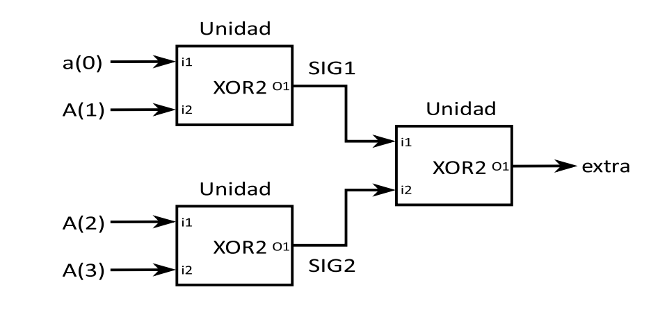
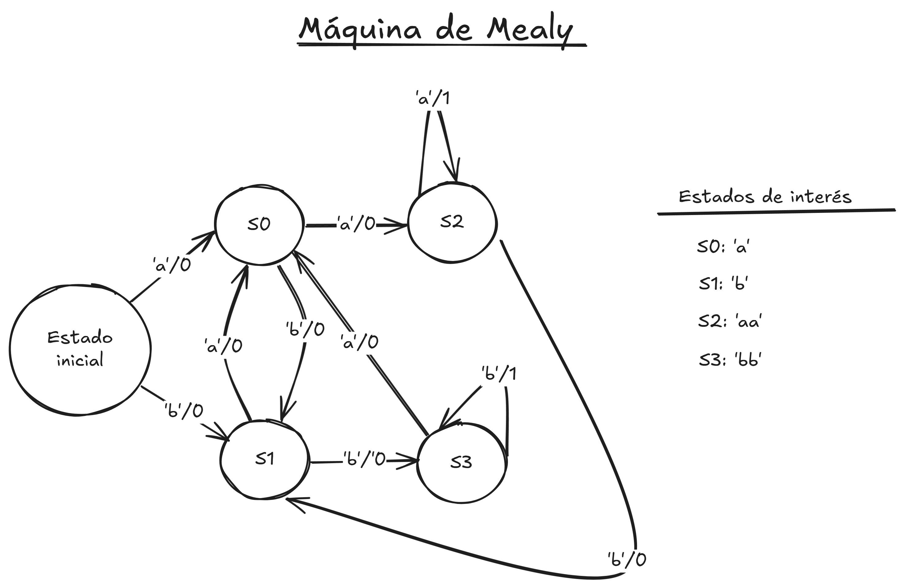
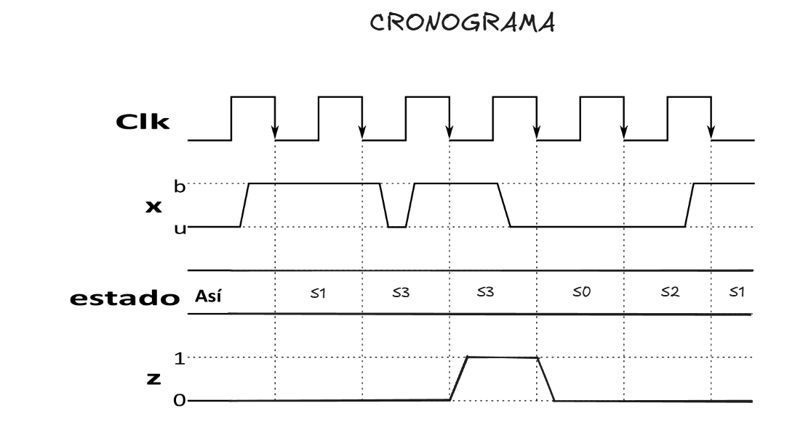
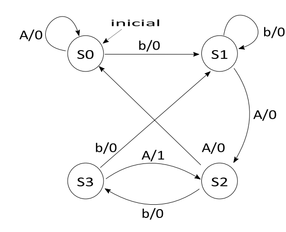
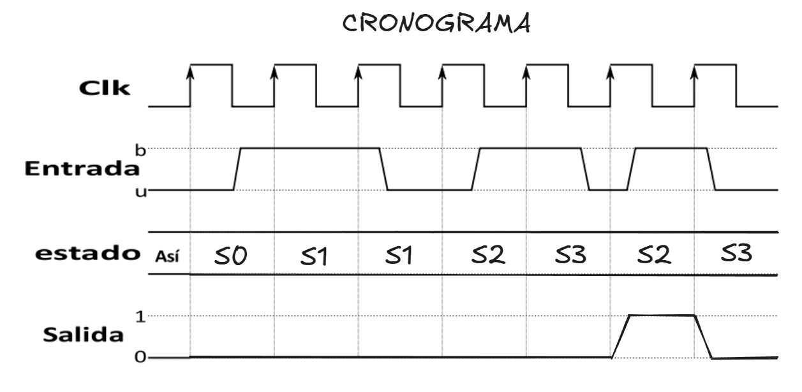

# Ejercicios TOC

## Mario González García

---

## Lección 1 – Modelado y diseño de hardware con VHDL

### 1. Codifica en VHDL

En todo el ejercicio he omitido el importe de la biblioteca:

```vhdl
library ieee;
use ieee.std_logic_1164.all;
```

#### XOR con dos entradas de 4 bits

```vhdl
entity xor_gate is
  port (
    e1: in std_logic_vector(3 downto 0);
    e2: in std_logic_vector(3 downto 0);
    s: out std_logic_vector(3 downto 0)
  );
end xor_gate;

architecture rtl of xor_gate is
begin 
  s <= e1 xor e2;
end architecture rtl;
```

#### Multiplexor 4:1

He decidido que las entradas sean de **4 bits** como en el XOR

```vhdl
entity mul is
  port (
    e0: in std_logic_vector(3 downto 0);
    e1: in std_logic_vector(3 downto 0);
    e2: in std_logic_vector(3 downto 0);
    e3: in std_logic_vector(3 downto 0);
    select: in std_logic_vector(1 downto 0);
    s: out std_logic_vector(3 downto 0)
  );
end mul;

architecture rtl of mul is
begin
  sel_entry: process (select)
  begin
    case select is
      when "00" => s <= e0;
      when "01" => s <= e1;
      when "10" => s <= e2;
      when "11" => s <= e3;
      when others => s <= "0000";
    end case;
  end process sel_entry;
end architecture rtl;
```

#### Decodificador 3:8

He decidido que las entradas sean de **4 bits** como en el XOR

```vhdl
entity dec is
  port (
    e: in std_logic_vector(2 downto 0);
    o: out std_logic_vector(7 downto 0)
  );
end dec;

architecture rtl of dec is
begin
  decodify: process (e)
  begin
    case e is
      when "000" => o <= "00000001";
      when "001" => o <= "00000010";
      when "010" => o <= "00000100";
      when "011" => o <= "00001000";
      when "100" => o <= "00010000";
      when "101" => o <= "00100000";
      when "110" => o <= "01000000";
      when "111" => o <= "10000000";
      when others => o <= "00000000";
    end case;
  end process decodify;
end architecture rtl;
```

#### Codificador 8:3

He decidido que las entradas sean de **4 bits** como en el XOR

```vhdl
entity cod is
  port (
    e: in std_logic_vector(7 downto 0);
    o: out std_logic_vector(2 downto 0)
  );
end cod;

architecture rtl of cod is
begin
  codify: process (e)
  begin
    if e(7) = '1' then o <= "111";
    elsif e(6) = '1' then o <= "110";
    elsif e(5) = '1' then o <= "101";
    elsif e(4) = '1' then o <= "100";
    elsif e(3) = '1' then o <= "011";
    elsif e(2) = '1' then o <= "010";
    elsif e(1) = '1' then o <= "001";
    elsif e(0) = '1' then o <= "000";
    else o <= "000";
    end if;
  end process codify;
end architecture rtl;
```

#### Comparador de 2 num (4 bits)

He decidido que las entradas sean de **4 bits** como en el XOR

```vhdl
entity comp is
  port (
    e1: in std_logic_vector(3 downto 0);
    e2: in std_logic_vector(3 downto 0);
    s: out std_logic
  );
end comp;

architecture rtl of comp is
begin
  comparate: process (e1, e2)
  begin
    if e1 = e2 then
      s <= '1';
    else
      s <= '0';
    end if;
  end process comparate;
end architecture rtl;
```

### 2. Codifica en VHDL un sistema combinatorio

* La entrada es un número entre 0 y 15
* La salida (Z) es 1 si:
  * La entrada es un número primo
  * La entrada es inferior a 4 y par
  * La entrada es mayor a 8 e impar

```vhdl
library ieee;
use ieee.std_logic_1164.all;
use ieee.numeric_std.all;

entity comb is 
  port (
    e: std_logic_vector(3 downto 0);
    Z: std_logic
  );
end comb;

architecture rtl of comb is
begin
  calc: process (e)
  begin
    if (to_integer(unsigned(e)) > 8) and (e(0) = '1') 
      Z <= '1';
    elsif (e = "0000") or (e = "0010") or (e = "0011") or (e = "0101") or (e="0111")
      Z <= '1';
    else
      Z <= '0';
    end if;
  end process calc;
end architecute rtl;
```

### 3. Codifica en VHDL un sistema combinatorio

* **Objetivo**: Multiplicador por 3
* La entrada es un entero positivo entre 0 y 7
* La salida (Z) es un entero positivo entre  0 y 15
* Existe una flag (D) para detectar overflow

```vhdl
library ieee;
use ieee.std_logic_1164.all;
use ieee.numeric_std.all;

entity comb is
  port (
    e: in std_logic_vector(2 downto 0);
    Z: out std_logic_vector(3 downto 0);
    D: out std_logic
  );
end comb;

architecture rtl of comb is
begin
  triplicate: process (e)
    variable temp : unsigned(4 downto 0);
  begin
    temp := 3 * unsigned(e);
    Z <= std_logic_vector(temp(3 downto 0));
    D <= temp(4);
  end process triplicate;
end architecture rtl;
```

### 4. Codifica en VHDL un sistema combinatorio

* **Objetivo**: Implementa este boceto



He decidido que las entradas sean de **4 bits** como en el **ejercicio 1**.

```vhdl
library ieee;
use ieee.std_logic_1164.all;

entity xor_gate is
  port (
    e1: in std_logic_vector(3 downto 0);
    e2: in std_logic_vector(3 downto 0);
    s: out std_logic_vector(3 downto 0)
  );
end xor_gate;

architecture rtl of xor_gate is
begin 
  s <= e1 xor e2;
end architecture rtl;

entity comb is
  port (
    A0: in std_logic_vector(3 downto 0);
    A1: in std_logic_vector(3 downto 0);
    A2: in std_logic_vector(3 downto 0);
    A3: in std_logic_vector(3 downto 0);
    extra: out std_logic_vector(3 downto 0)
  );
end comb;

architecture rtl of comb is
  component xor_gate
    port (
      e1: in std_logic_vector(3 downto 0);
      e2: in std_logic_vector(3 downto 0);
      s: out std_logic_vector(3 downto 0)
    );
  end component;

  signal temp1, temp2: std_logic_vector(3 downto 0);

begin
  xor1: xor_gate port map (
    e1 => A0,
    e2 => A1,
    s => temp1
  );

  xor2: xor_gate port map (
    e1 => A2,
    e2 => A3,
    s => temp2
  );

  xor3: xor_gate port map (
    e1 => temp1,
    e2 => temp2,
    s => extra
  );

end architecture rtl;
```

### 5. Codifica en VHDL un sistema secuencial y completa el cronograma

* **Objetivo**: Implementa el sistema para que la salida (z) cumpla:

$$
z(t) =
\begin{cases}
1 & \text{si } x(t-2, t-1, t) = 'aaa' \text{ o } 'bbb' \\
0 & \text{en otro caso}
\end{cases}
$$



```vhdl
library ieee;
use ieee.std_logic_1164.all;

entity seq_detector is
  port (
    clk : in std_logic;
    reset : in std_logic;
    x : in std_logic;
    z : out std_logic
  );
end seq_detector;

architecture rtl of seq_detector is
  type state_type is (EI, S0, S1, S2, S3);
  signal state, next_state : state_type;

begin
  change_state : process (clk, reset)
  begin
    if reset = '1' then
      state <= EI;
    elsif rising_edge(clk) then
      state <= next_state;
    end if;
  end process change_state;

  calc_state_out : process (state, x)
  begin
    next_state <= state;
    z <= '0';

    case state is
      when EI =>
        if x = '0' then
          next_state <= S0;
        elsif x = '1' then
          next_state <= S1;
        end if;
      
      when S0 =>
        if x = '0' then
          next_state <= S2;
        elsif x = '1' then
          next_state <= S1;
        end if;

      when S1 =>
        if x = '0' then
          next_state <= S0;
        elsif x = '1' then
          next_state <= S3;
        end if;

      when S2 =>
        if x = '0' then
          next_state <= S2;
          z <= '1';
        elsif x = '1' then
          next_state <= S1;
        end if;

      when S3 =>
        if x = '0' then
          next_state <= S0;
        elsif x = '1' then
          next_state <= S3;
          z <= '1';
        end if;

      when others =>
        next_state <= EI;
    end case;
  end process calc_state_out;
end architecture rtl;
```

* **Objetivo**: Completar el cronograma:



### 6. Sobre una FSM Mealy



* **Objetivo**: Reconoce el patrón detectado

La única combinación que resulta en '1' es aquella cuya en el **S3** recibe una **entrada de valor A**.

Para llegar ahí se necesita:

S0 - B -> S1 - A -> S2 - B -> S3 - A -> S2

Es decir: BABA. Sin embargo para volver a obtener un 1 necesitaríamos:

S2 - B -> S3 - A -> S2

Por tanto, el patrón es "BABA"

* **Objetivo**: Implementar en VHDL

```vhdl
library ieee;
use ieee.std_logic_1164.all;

entity seq_detector is
  port (
    clk: in std_logic;
    rst: in std_logic;
    x: in std_logic;
    z: out std_logic
  );
end seq_detector;

architecture rtl of seq_detector is
  type state_type is (S0, S1, S2, S3);
  signal state, next_state : state_type;
  
begin
  change_state : process (clk, reset)
  begin
    if reset = '1' then
      state <= S0;
    elsif rising_edge(clk) then
      state <= next_state;
    end if;
  end process change_state;

  calc_state_out : process (state, x)
  begin
    next_state <= state;
    z <= '0';

    case state is
      when S0 =>
        if x = '0' then
          next_state <= S0;
        elsif x = '1' then
          next_state <= S1;
        end if;

      when S1 =>
        if x = '0' then
          next_state <= S2;
        elsif x = '1' then
          next_state <= S1;
        end if;

      when S2 =>
        if x = '0' then
          next_state <= S0;
        elsif x = '1' then
          next_state <= S3;
        end if;
      
      when S3 =>
        if x = '0' then
          next_state <= S2;
          z <= '1':
        elsif x = '1' then
          next_state <= S1;
        end if;

      when others =>
        next_state <= S0;
    end case;
  end process calc_state_out;
end architecture rtl;
```

* **Objetivo**: Completar el cronograma:


